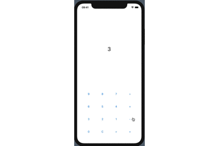
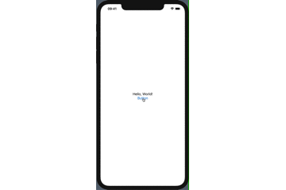
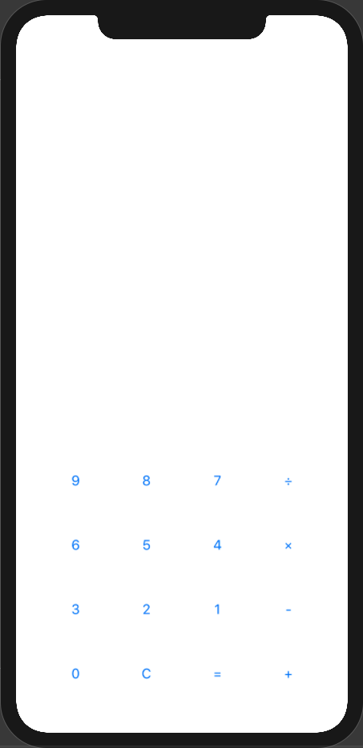

 この電卓アプリで
- VStack : 垂直方向の制約
- HStack : 水平方向の制約
- Spacer() : 余白を作成
- @State :  Viewのデータを編集することでができる変数
- Text : UIKitだとUILabel
- Button : UIKitだとUIButton
- ForEach : View作成専門の繰り返し処理

上記7つの内容をアウトプットすることが目的で作成しました。

----

# 完成品


# 作成手順

## ボタンを押下したらテキストが変化する初歩的なプログラムから作成
```php:ContentView.swift
import SwiftUI

struct ContentView: View {
    @State var resultScreen = "Hello, World!" // Textの内容を保存する変数
    var body: some View {
        VStack {
            Text(resultScreen)
            Button(action: {
                self.resultScreen = "Button Tapped"
            }){
                Text("Button")
            }
        }

    }
}

struct ContentView_Previews: PreviewProvider {
    static var previews: some View {
        ContentView()
    }
}
```

このプログラムを動作させるとこうないります。  


## 複数のButtonを作成
Buttonを１つだけ宣言し、ForEachで合計16個に増やします。ForEachの使い方は、[こちらのサイト](https://d1v1b.com/swiftui/use_foreach_for_loop_data)がわかりやすくまとめているため、使い方がわからない人は是非参考にしてください。

```php:ContentView.swift  
// Buttonで使うTextを配列にまとめる
let inputItem = [["9","8","7","÷"],
                ["6","5","4","×"],
                ["3","2","1","-"],
                ["0","C","=","+"]]

ForEach((0...3), id: \.self) { row in
  HStack{
    ForEach((0...3), id: \.self){ col in
      Button(action: {
        // 条件分岐を加え、処理内容を変化させる
      }){
        Spacer()
        Text(self.inputItem[row][col])
        Spacer()
      }
    }
  }
  .padding(30)
}
```
このプログラムを実行したらこのようなUIになります。  



あとは、actionないに条件分岐で処理内容を変更することにより電卓として動作します。  

お疲れ様でした。

# プログラムについて
今回作成したプログラムは、GitHub上で公開しています。ご自由に使ってください。
https://github.com/r0227n/SwiftUI/tree/master/calculatorApp

# 参考サイト
ForEachの使い方：https://d1v1b.com/swiftui/use_foreach_for_loop_data  
Buttonの使い方：https://i-app-tec.com/swiftui/swiftui-button.html
