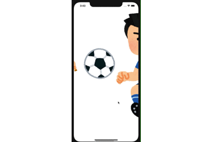
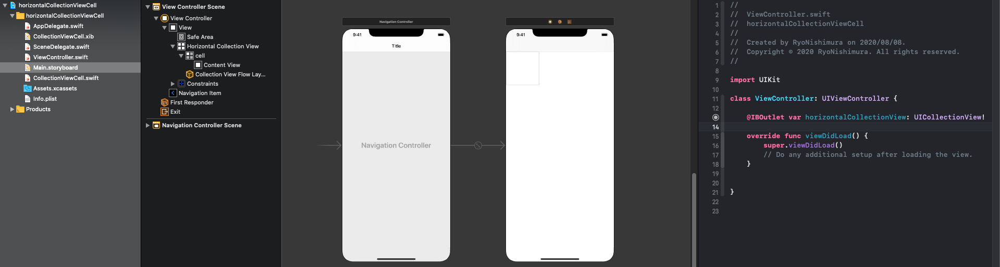
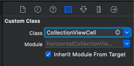

ÓSwift初学者の筆者がCollectionViewの使い方の備忘録として執筆しました。  
[超参考になるCollectionViewの使い方](https://qiita.com/misakiagata/items/acf869a5c7fc4cebaaad)を参考に本記事を執筆しましたので、参考サイトにLGTMお願いします。
# 完成品
  
CollectionViewを使い、画面を横スクロールすることで画像（表示内容）を動かすアプリケーションです。

# storybordの設定
## Main.storybordで行う設定


### CollectionViewの設定
- AutoLayoutをする
- ViewController.swiftとIBoutlet接続する
- ViewController.swiftと紐付けて「dataSource」と「delegate」を編集できるよにする。  
  (CollectionViewにマウスを合わせて、"control"を押しながらViewControllerの黄色い丸印までドラッグ・アンド・ドロップ)
- 属性インスペクタの[Scroll Direction]を[Horizontal]に設定  
 （[Scroll Direction]でスワイプの方向を指定することができる）  
  

### CollectionViewCellの設定
- xibと紐づいているファイルをclassに指定する。
- [identifler]を「cell」にします。  


## xibで行う設定
ImageViewを追加してください。

### ImageViewの設定
- AutoLayoutをする
- CollectionViewCell.swiftとIBoutlet接続する

# コード
```php:ViewController.swift
import UIKit

class ViewController: UIViewController {

    @IBOutlet var horizontalCollectionView: UICollectionView!

    var viewWidth: CGFloat!
    var viewHeight: CGFloat!
    var cellWitdh: CGFloat!
    var cellHeight: CGFloat!
    var cellOffset: CGFloat!
    var navHeight: CGFloat!

    var photoArray = ["baseball","soccer"]

    override func viewDidLoad() {
        super.viewDidLoad()
        // Do any additional setup after loading the view.
        viewWidth = view.frame.width
        viewHeight = view.frame.height
        //ナビゲーションバーの高さ
        navHeight = self.navigationController?.navigationBar.frame.size.height

        //xib読み込み
        let nib = UINib(nibName: "CollectionViewCell", bundle: .main)
        horizontalCollectionView.register(nib, forCellWithReuseIdentifier: "cell")

        //空の背景画像を設定
        self.navigationController!.navigationBar.setBackgroundImage(UIImage(), for: .default)
        //ナビゲーションバーの影画像を空に設定
        self.navigationController!.navigationBar.shadowImage = UIImage()
        //アイテムの色を指定
        self.navigationController?.navigationBar.tintColor = .white
        //タイトル色の指定
        self.navigationController?.navigationBar.titleTextAttributes = [.foregroundColor: UIColor.white]
    }
}

//ViewControllerのプロトコル定義
extension ViewController: UICollectionViewDelegate, UICollectionViewDataSource, UICollectionViewDelegateFlowLayout {
    //collectionViewの要素の数を返す
    func collectionView(_ collectionView: UICollectionView, numberOfItemsInSection section: Int) -> Int {
        return photoArray.count
    }

    //collectionViewのセルを返す（セルの内容を決める）
    func collectionView(_ collectionView: UICollectionView, cellForItemAt indexPath: IndexPath) -> UICollectionViewCell {
        let cell = collectionView.dequeueReusableCell(withReuseIdentifier: "cell", for: indexPath) as! CollectionViewCell
        cell.backgroundImageView.image = UIImage(named: photoArray[indexPath.row])
        return cell
    }

    //セル間の間隔を指定
    private func collectionView(_ collectionView: UICollectionView, layout collectionViewLayout: UICollectionViewLayout, minimunLineSpacingForSectionAt section: Int) -> CGFloat {
        return 24
    }

    //セルのサイズ(CGSize)
    func collectionView(_ collectionView: UICollectionView, layout collectionViewLayout: UICollectionViewLayout, sizeForItemAt indexPath: IndexPath) -> CGSize {
        cellWitdh = viewWidth-75
        cellHeight = viewHeight-300
        cellOffset = viewWidth-cellWitdh
        return CGSize(width: cellWitdh, height: cellHeight)
    }

    //余白の調整（UIImageを拡大、縮小している）
    func collectionView(_ collectionView: UICollectionView, layout collectionViewLayout: UICollectionViewLayout, insetForSectionAt section: Int) -> UIEdgeInsets {
        //top:ナビゲーションバーの高さ分上に移動
        return UIEdgeInsets(top: -navHeight,left: cellOffset/2,bottom: 0,right: cellOffset/2)
    }

}
```

```php:CollectionViewCell.swift
import UIKit

class CollectionViewCell: UICollectionViewCell {

    @IBOutlet var backgroundImageView: UIImageView!
    override func awakeFromNib() {
        super.awakeFromNib()
        // Initialization code
    }

}
```
(プログラムは、https://qiita.com/misakiagata/items/acf869a5c7fc4cebaaad から引用しました。)

# 参考サイト
https://qiita.com/misakiagata/items/acf869a5c7fc4cebaaad


# サンプルプログラム
今回作成したプログラムをGitHub上で公開しています。参考になれば嬉しいです。  
https://github.com/r0227n/qiita/tree/master/Program/horizontalCollectionViewCell
