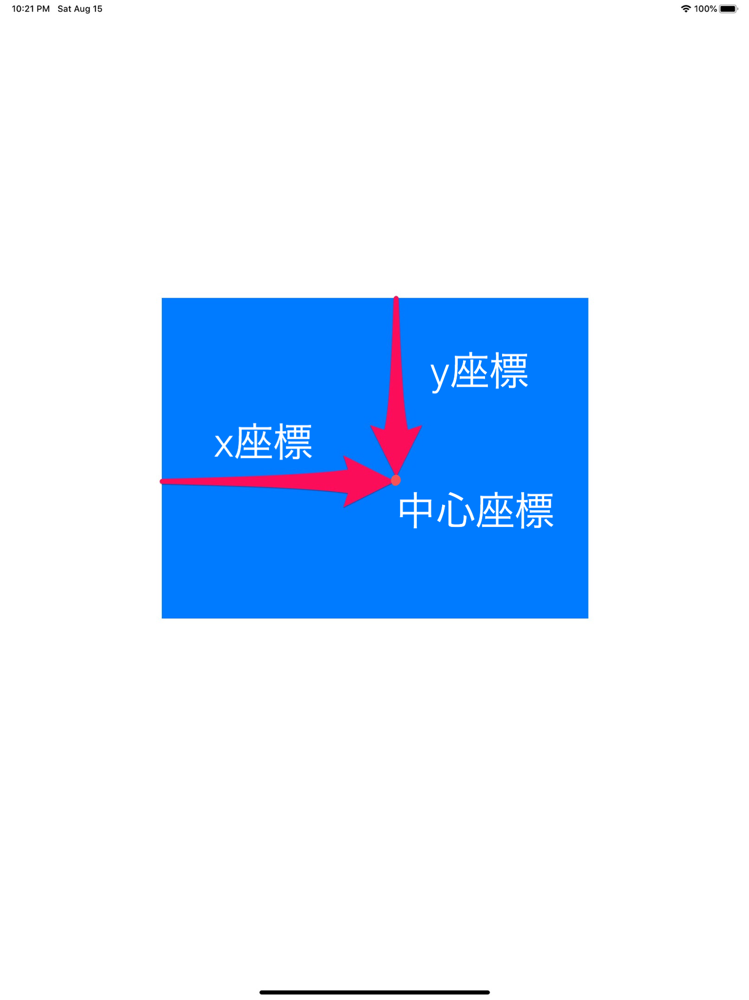
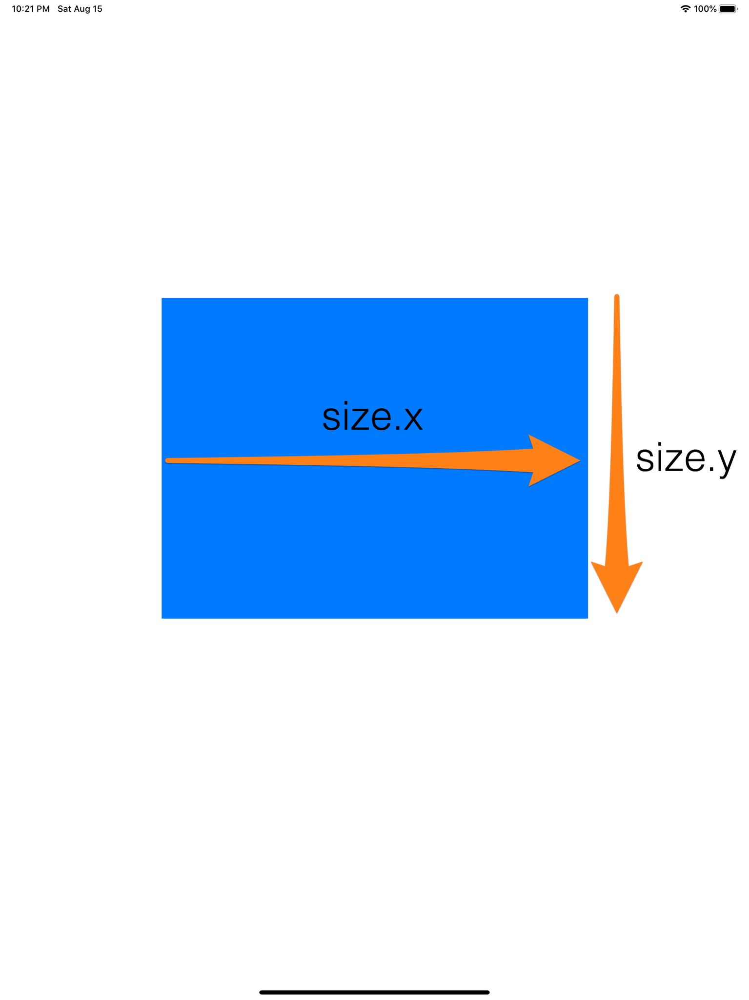
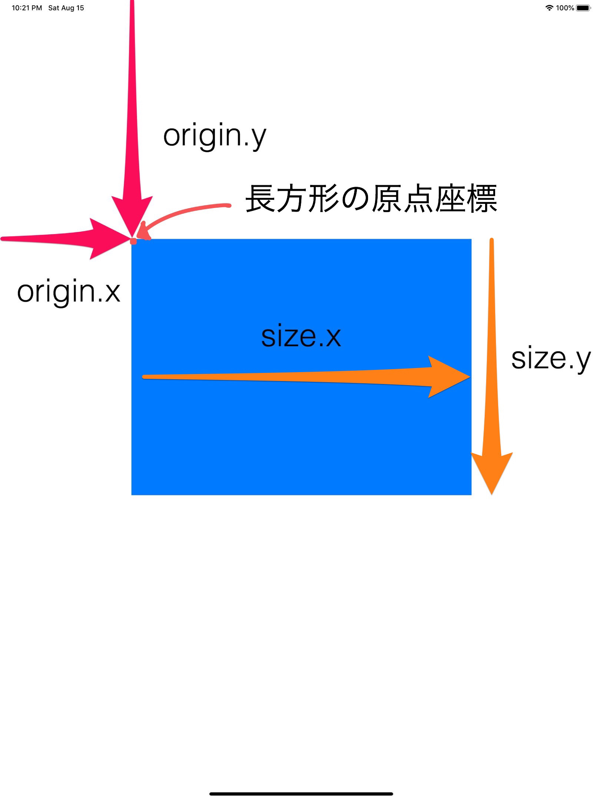

長方形オブジェクトの基本についてまとめました。

## origin
長方形の原点座標を指定するインスタンスプロパティ

## size
長方形の高さと幅を指定するインスタンスプロパティ

## CGPoint
２次元座標系の点を指定する構造体です。
CGPointMake()で引数にオブジェクトを表示したい「中心座標x,中心座標y」を指定することにより作成できる。
```
// 宣言
var originc: CGPoint
// CGPintの作成
CGPoint point = CGPointMake(x, y)
```


## CGSize
長方形の高さと幅を指定する構造体です。  
CGSizeMake()で引数にオブジェクトの「幅,高さ」を指定することにより作成できる。  
距離ベクトルだけでなく、物理的な大きさ（ARとか？）を表すために使用することもあるらしい。
```
// 宣言
var size: CGSize
// CGSizeの作成
CGSize size = CGSizeMake(width, height)
```


## CGRect
長方形の位置と寸法を含む構造体です。  
CGRectMake()で引数にオブジェクトの「原点x,原点y,幅,高さ」を指定することにより作成できる。  

```
// 宣言
struct CGRect
// CGRectの生成
CGRect rect = CGRectMake(origin.x, origin.y, size.x, size.y)
```


# 参考文献
- origin:https://developer.apple.com/documentation/coregraphics/cgrect/1454354-origin
- size:https://developer.apple.com/documentation/coregraphics/cgrect/1455155-size
- CGPint:https://developer.apple.com/documentation/coregraphics/cgpoint
- CGSize:https://developer.apple.com/documentation/coregraphics/cgsize
- CGRect:https://developer.apple.com/documentation/coregraphics/cgrect
